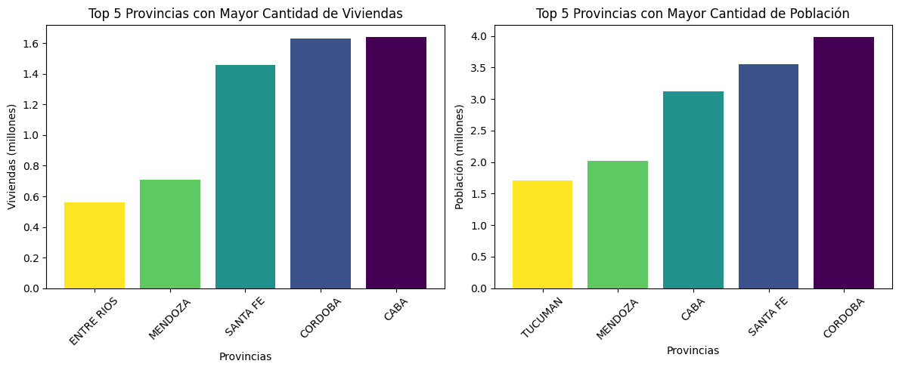
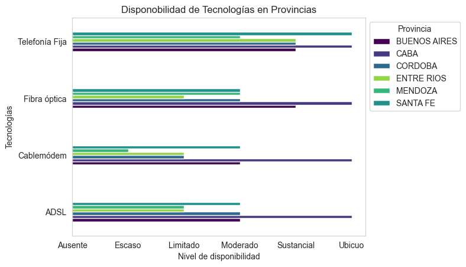
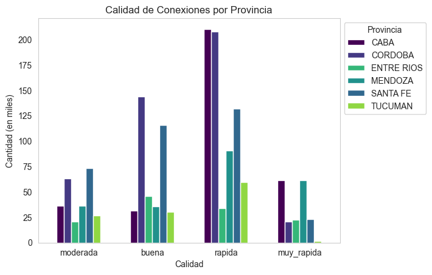
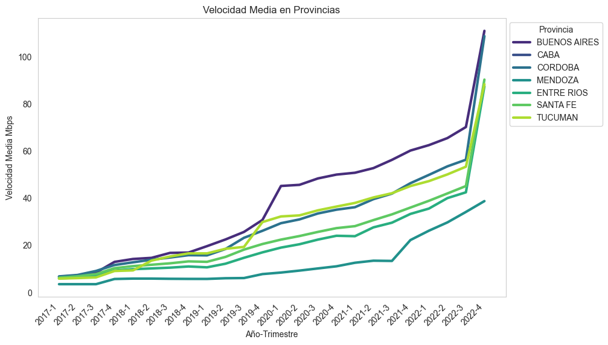
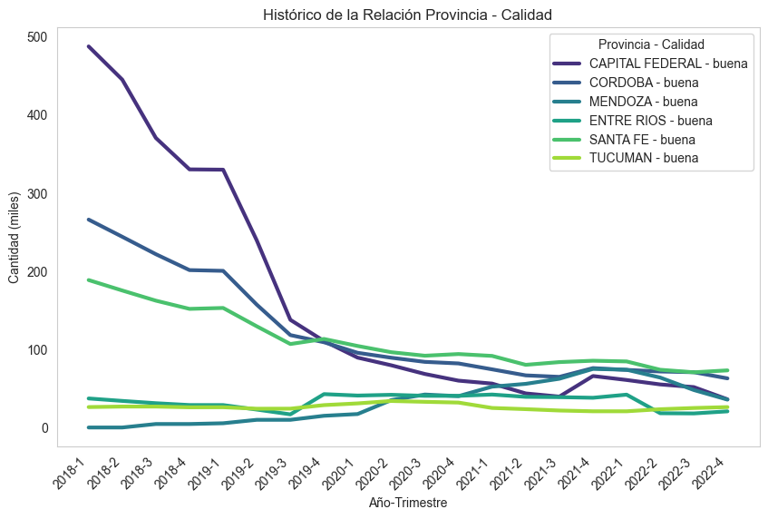
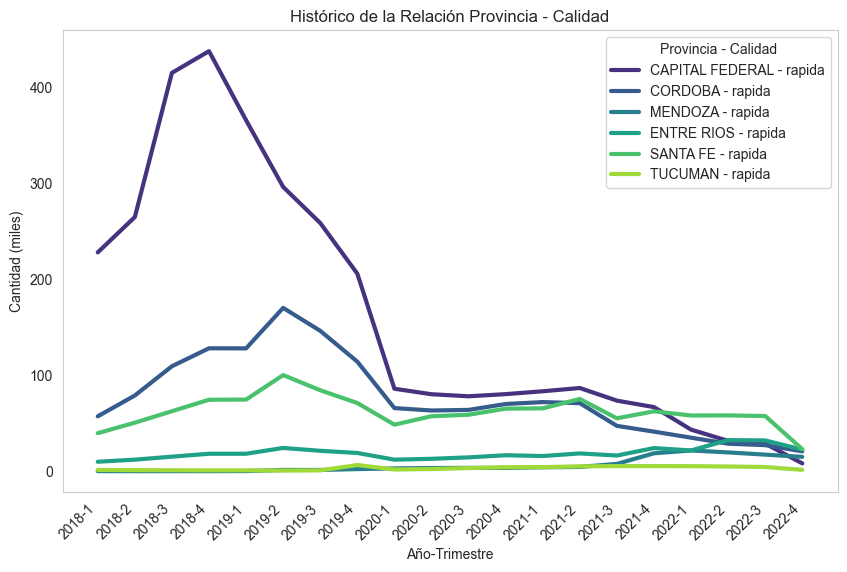
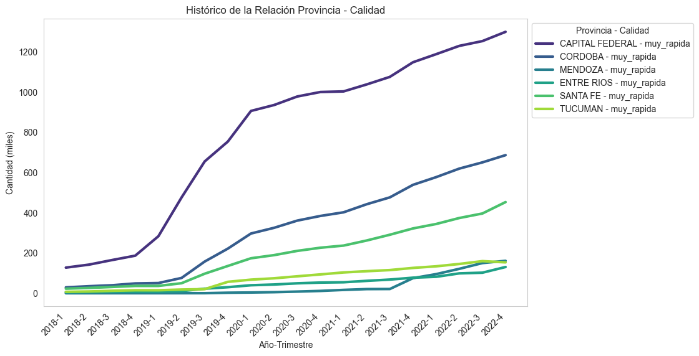
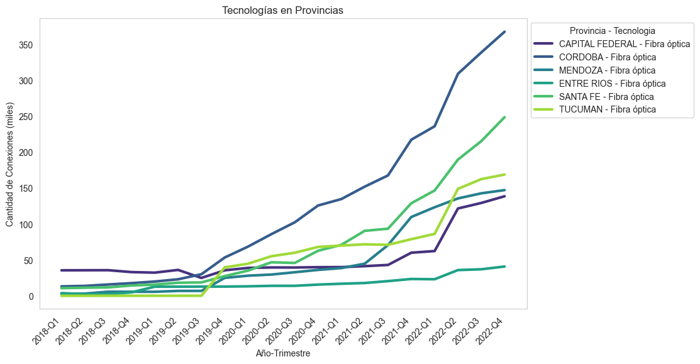

# <h1 align="center">**`Turbo Fibra Ltd. - Informe de Data Analytics`**</h1>

¡Bienvenidos a Turbo Fibra Ltd. - Sucursal Argentina! 🚀 Como empresa contratada para llevar a cabo el análisis de datos, hemos explorado detalladamente el panorama del sector de Internet en Argentina, trabajando mano a mano con Turbo Fibra Ltd. para identificar oportunidades clave y ofrecer soluciones personalizadas. A continuación, presentamos los hallazgos y recomendaciones.

# Objetivo del Informe
Este informe tiene como objetivo analizar el sector de Internet en Argentina, identificar oportunidades de crecimiento y ofrecer soluciones personalizadas para mejorar la oferta de servicios de Internet.

# Tecnologías y Herramientas Utilizadas

El proyecto se desarrolla en Jupyter Notebook utilizando las siguientes bibliotecas:

- **Pandas:** Para manipulación y análisis de datos.
- **Numpy:** Para operaciones numéricas eficientes.
- **Matplotlib y Seaborn:** Para la creación de visualizaciones gráficas.

# Metodología Aplicada

El análisis de datos se llevó a cabo siguiendo los siguientes pasos:

1. **Visualización Inicial:**
   - Exploración de los datasets disponibles en la página web de [ENACOM](https://datosabiertos.enacom.gob.ar/dashboards/20000/acceso-a-internet/).

2. **Extracción de Datos:**
   - Descarga de los datasets en formatos CSV y Excel. Se optó por esta opción en lugar de utilizar la API debido a limitaciones en la completitud de los datos proporcionados.

3. **Preprocesamiento de Datos:**
   - Normalización de nombres de columnas y valores.
   - Reemplazo de valores específicos.
   - Eliminación de duplicados y consolidación de filas duplicadas.

4. **Categorización y Transformación:**
   - Categorización de variables para facilitar el análisis.
   - Reducción de la dimensionalidad de los dataframes cuando fue necesario.
   - Escalamiento de cantidades para una interpretación más sencilla.

5. **Visualización Gráfica:**
   - Creación de gráficos de barras, barras apiladas y lineales para representar visualmente los datos.

6. **Análisis Estadístico:**
   - Desarrollo de estadísticas descriptivas para obtener una comprensión más profunda de los datos.

# Comportamiento del Sector Internet en Argentina

Antes de sumergirnos en el análisis del sector de Internet, es crucial entender la infraestructura demográfica del país. Hemos explorado la distribución de viviendas y población en cada provincia utilizando datos del [Censo 2022](https://www.indec.gob.ar/ftp/cuadros/poblacion/cnphv2022_condiciones_habitacionales_05_23A5A5DCDF38.pdf).  

### Gráfico 1: Comparación de Cantidad de Viviendas y Población por Provincia

  

Este gráfico compara las cinco provincias con mayor cantidad de viviendas y población, proporcionando una visión integral de la infraestructura habitacional y densidad poblacional. Nota: Buenos Aires no se incluyó visualmente debido a su magnitud.

Con esta base demográfica, continuaremos nuestro análisis para entender mejor el comportamiento del sector de Internet en Argentina.

### Gráfico 2: Disponibilidad de Tecnologías en Provincia

El siguiente gráfico muestra la disponibilidad de tecnologías en las seis provincias con mayor infraestructura de viviendas a nivel nacional.

  

**Insight**   
Las provincias muestran un nivel sustancial y ubicuo en telefonía fija, sugiriendo la viabilidad de implementar fibra óptica, cablemódem y/o ADSL. Esto genera competencia en la Capital Federal, que tiene disponibilidad ubicua en todas las tecnologías.

### Gráfico 3: Calidad de Conexiones por Provincia

Este gráfico presenta la calidad de conexiones en las seis provincias, categorizando las velocidades. ¡Descubrimos que la calidad rápida predomina, pero la muy rápida es clave para el futuro!

  

**Insight**   
Aunque la calidad rápida es común, la estrategia debería centrarse en promover la tecnología de Fibra Óptica, especialmente para las provincias con calidades más bajas.

### Gráfico 4: Velocidad Media en Provincias

Este gráfico muestra el aumento de la velocidad media a lo largo de los años en las seis provincias.

  

**Insight**  
Desde 2019, observamos un crecimiento en la velocidad media, indicando una alta probabilidad de adquisición de fibra óptica y su auge.

# Identificación de Oportunidades de Crecimiento

A continuación mostraremos una serie de gráficos con respecto a las provincias y la calidad de velocidad buena, rápida y muy rápida.

### Gráfico 1: Calidad Buena

Este gráfico histórico ilustra la disminución en el número de conexiones desde el año 2018, destacando una caída más pronunciada en la Capital Federal de Buenos Aires, Córdoba y Santa Fe.

  

### Gráfico 2: Calidad Rápida

De manera similar al gráfico anterior, observamos una disminución en las conexiones desde el año 2018, especialmente pronunciada en la Capital Federal de Buenos Aires, Córdoba y Santa Fe. Podemos inferir que hay un auge durante y después del año 2018.

  

### Gráfico 3: Calidad Muy Rápida

En contraste con los gráficos anteriores, el año 2018 marca una disminución en la calidad de velocidad buena y rápida, pero es un punto de aumento significativo en la calidad de velocidad muy rápida. Esto sugiere que las provincias están migrando hacia velocidades superiores a +30 Mbps, destacando la importancia de la fibra óptica.

  

### Gráfico 4: Tecnología Fibra Óptica

Este gráfico confirma que la migración predominante ha sido hacia la **fibra óptica** en las principales provincias. Este respaldo sólido refuerza la decisión estratégica de considerar la implementación de fibra óptica para ofrecer servicios de Internet de alta velocidad en estas regiones clave.

  

# Oferta de Soluciones Personalizadas

1. **Prestación de Servicios a través de Fibra Óptica:**
   Se recomienda fuertemente la adopción y expansión de servicios de Internet a través de la tecnología de Fibra Óptica. Este respaldo se basa en la alta velocidad y confiabilidad que ofrece, así como en la tendencia observada en las principales provincias.

2. **Establecer Alianzas Estratégicas con Empresas de Telefonía Fija:**
   Para aprovechar la infraestructura existente, se sugiere establecer alianzas estratégicas con empresas de telefonía fija. Colaborar con estas empresas permitirá aprovechar su estructura de cableado, facilitando la implementación de servicios de fibra óptica.

3. **Ofrecer Paquetes Competitivos en el Mercado:**
   Para atraer y retener clientes, se recomienda ofrecer paquetes de velocidad competitivos en el mercado. Analizar las ofertas actuales y ajustar los precios y velocidades para ser competitivos y atractivos para los usuarios finales.

4. **Alianzas con Empresas de ADSL y Cablemódem:**
   Con el objetivo de cumplir con los objetivos de expansión, se sugiere explorar alianzas con empresas que brindan tecnología ADSL y Cablemódem. Esto podría permitir una cobertura más amplia y llegar a áreas donde la fibra óptica podría no ser inicialmente viable.

5. **Incentivar el Uso de Tecnologías Más Rápidas:**
   Se recomienda implementar estrategias de marketing para incentivar el uso de tecnologías más rápidas, especialmente la fibra óptica. Educación al cliente, ofertas promocionales y programa

# KPI's Recomendados

1. **Crecimiento del Acceso a Internet por Cada 100 Hogares**
   - Fórmula: ((Nuevo acceso - Acceso actual) / Acceso actual) * 100
   -  Este KPI mide el aumento en el acceso a Internet por cada 100 hogares en cada provincia.
2. **Velocidad Media de Conexión**
   - Fórmula: (Suma de velocidades de conexión de todos los hogares / Número total de hogares)
   - Este KPI evalúa la calidad del servicio en términos de velocidad de conexión.

3. **Ingresos por Usuario**
   - Fórmula: (Ingresos totales / Número total de usuarios) 
   - Este KPI evalúa la rentabilidad por usuario.

**Nota:** Buenos Aires no se incluyó en algunos gráficos debido a su magnitud, pero su comportamiento es similar a las provincias evaluadas.

¡Turbo Fibra Ltd. está listo para revolucionar el acceso a Internet en Argentina! 🚀🌐

## Contribuyentes

- **Leonel Cortez**
  - GitHub: [leocorbur](https://github.com/leocorbur)
  - Correo electrónico: leocorbur@gmail.com
  - Rol: Desarrollador principal

